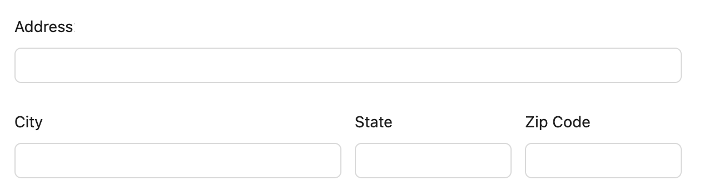
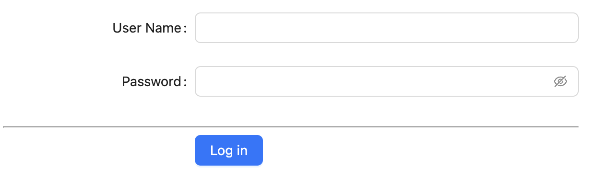

# nice-form-react

While there're already some form libraries/frameworks focus on state management or reuseful components, NiceForm mainly focus on form layout, conditionally show/hide form fields, switch view/edit modes, etc, in a meta based approach.

It is a small utility with zero dependencies and can be seamlessly integrated with any React UI library or form state manager and comes with built-in support for native HTML, [antd.design](https://ant.design), and [Formik](https://formik.org) + [MUI](https://mui.com).

Before reading through the detailed introduction below, we suggest you first go through our examples page so that you get a quick glance at the scenarios NiceForm is used for and how API looks like:

- MUI + Formik: https://opensource.ebay.com/nice-form-react/formik
- Ant.Design: https://opensource.ebay.com/nice-form-react/antd

## Get Started

First, install nice form as a dependency:

```bash
npm i @ebay/nice-form-react
```

Then, config NiceForm to use which UI library by adding adapter(s) to your app entry (usually `src/main.tsx`):

```jsx
import { config as niceFormConfig } from '@ebay/nice-form-react';
import formikAdapter from '@ebay/nice-form-react/adapters/formikAdapter';
import formikMuiAdapter from '@ebay/nice-form-react/adapters/formikMuiAdapter';

niceFormConfig.addAdapter(formikAdapter);
niceFormConfig.addAdapter(formikMuiAdapter);
```

At last, use it to render your form:

```jsx
import { Form, Formik, FormikProps } from 'formik';
import Button from '@mui/material/Button';
import NiceForm from '@ebay/nice-form-react';
import { FormikMuiNiceFormMeta } from '@ebay/nice-form-react/adapters/formikMuiAdapter';

const Simple = () => {
  const initialValues = {
    username: '',
    password: '',
  };

  const getMeta = (form: FormikProps<typeof initialValues>) => {
    const formMeta: FormikMuiNiceFormMeta = {
      columns: 1,
      rowGap: 18,
      form,
      initialValues,
      disabled: form.isSubmitting,
      fields: [
        {
          key: 'username',
          label: 'User Name',
          widget: 'text',
        },
        {
          key: 'password',
          label: 'Password',
          widget: 'text',
          widgetProps: {
            type: 'password',
          },
        },
        {
          key: 'submit',
          render: () => {
            return (
              <Button type="submit" variant="contained">
                Log in
              </Button>
            );
          },
        },
      ],
    };
    return formMeta;
  };

  return (
    <div style={{ width: '400px' }}>
      <Formik
        initialValues={initialValues}
        onSubmit={async (values) => {
          await new Promise((r) => setTimeout(r, 500));
          alert(JSON.stringify(values, null, 2));
        }}
      >
        {(form) => {
          return (
            <Form>
              <NiceForm meta={getMeta(form)} />
            </Form>
          );
        }}
      </Formik>
    </div>
  );
};
```

Here is the result:


## Key Features

- Small: ~3kb gzipped.
- Easy layout: grid based layout system.
- Meta based: easy to show/hide fields dynamically.
- View/edit modes: one meta to support both view and edit modes.
- Flexible: you can mix meta and original API to create forms.
- Out of box: built-in support for Mui and AntD.
- Extensible: easy to create custom adapters to support more UI libraries.

## How it works?

Understanding the workings of NiceForm is essential, as it paves the way for effortless usage across various scenarios. NiceForm's simplicity lies not in magic but in its mechanism that transforms meta objects into JSX APIs offered by corresponding form libraries. Consider the straightforward usage mentioned above as an example:

```jsx
const MyComp = () => {
  const formMeta = {
    fields: [
      { key: 'username', label: 'User Name' },
      { key: 'password', label: 'Password', widget: 'password' },
    ],
  };

  return <NiceForm meta={formMeta} />;
};
```

The logic just transforms meta to JSX:

```jsx
const MyComp = () => {
  return (
    <>
      <FormItem key="username" label="User Name"><Input/><FormItem>
      <FormItem key="password" label="Password"><Input type="password"/><FormItem>
    </>
  );
}

```

So `NiceForm` itself can be used anywhere, but usually you just put `<NiceForm />` in some form context. Similarily, since it's just a helper, you can provide multiple `NiceForm` tags in one form:

```jsx
const meta1 = {...}
const meta2 = {...}

return (
  <Form>
    <NiceForm meta={meta1} />
    <SomeOtherContent...>
    <NiceForm meta={meta2} />
  </Form>
);
```

Besides that, nice form puts fields into a grid layout system. So if necessary, a field rendered by nice form is wrapped with a wrapper to be layouted by css grid. For example, we can define the total columns of the form and specify how many columns a field takes:

```jsx
const meta = {
    columns: 4,
    columnGap: 12,
    fields: [
      { key: 'address2', label: 'Address', colSpan: 4 },
      { key: 'city', label: 'City', colSpan: 2 },
      { key: 'state', label: 'State' },
      { key: 'zip', label: 'Zip Code' },
    ]
```

Then you get the form like below:



Note that, a field meta is not necessary being a form field, but any UI element, for example, in the simple usage case, we define button with raw UI library, alternatively you can also define it with meta:

```jsx
const meta = {
  columns: 1,
  fields: [
    { key: 'username', label: 'User Name' },
    { key: 'password', label: 'Password', widget: 'password' },

    // You can define a render method to render anything
    {
      key: 'hr',
      label: null,
      render: () => <hr />,
    },
    // Here you can define the button by meta, note a widget can be any react component
    {
      key: 'btn',
      label: null,
      wrapperCol: { span: 16, offset: 8 },
      widget: Button,
      widgetProps: { type: 'primary', children: 'Log in' },
    },
  ],
};

return <NiceForm meta={meta} />;
```

The you get the UI like below:



## Layout

NiceForm uses css grid to layout fields of a form. The related props include:

- FormMeta.columns: how many columns of the form, the default value is `1`.
- FormField.colSpan: how many columns the field takes, for example, for FormMeta.columns is `3`, the field `colSpan` is `2` then the field takes 2/3 row space.
- FormField.clear: the value can be `left`, `right` or `both`. It means if there can be a field shows in left, right or none. It will ignore `colSpan` value.

## Conditionally show/hide fields

// TODO

## View Mode and Edit Mode

Typically, NiceForm provides two modes for form: edit mode and view mode. So you usually can render two modes of a form with a single meta object. For each field, you can define how a field is rendered under edit mode or view mode.

The mode could be form level or field level.

TODO: add more explaination here.

## API Reference

To create a form with Nice Form, you usually use below APIs:

- NiceForm component: a holder component to render form by meta. Always: `<NiceForm meta={meta} />`
- NiceFormMeta: the structure to define the form meta.
- NiceFormField: the element type of `fields` property of `NiceFormMeta`. Used to define a form field.

Note that, `NiceFormMeta` and `NiceFormField` are extensible. Different adapters usually provide their own meta type (inheriting the base) to provide customized/enhanced behaviors.

For built-in adapters, you can see meta types in

- AntdFormMeta
- AntdFormFieldMeta
- MuiFormMeta
- MuiFormFieldMeta

Here is the common meta properties:

```ts
export interface NiceFormMeta extends Record<string, any> {
  /**
   * If you have mulitple forms in one page, you may set different names so that fields ids will not conflict.
   */
  name?: string; // used as prefix for form field id

  /**
   * How many columns in the grid layout system.
   */
  columns?: number;

  /**
   * The label width of the field. It differs when using different adapters.
   * For example, you can use 1-24 in antd, but it's unncessary in MUI.
   */
  labelWidth?: number | string; // 1-24

  /**
   * The column gap of the grid layout system.
   */
  columnGap?: string | number;

  /**
   * The row gap of the grid layout system.
   */
  rowGap?: string | number;

  /**
   * Whether the form is disabled (means all fields are disabled)
   */
  disabled?: boolean;

  /**
   * ?
   */
  layout?: any;

  /**
   * Whether the form is in view mode. If true, all fields will be rendered with viewWidget.
   */
  viewMode?: boolean;

  /**
   * The default widget component or widget id for fields in edit mode. This overrides the defaultWidget in config.
   */
  defaultWidget?: string | ReactComponent | null;

  /**
   * The default widget component or widget id for fields in view mode. This overrides the defaultViewWidget in config.
   */
  defaultViewWidget?: string | ReactComponent | null;

  /**
   * Deprecated.
   */
  wrapperProps?: Record<string, any>;

  /**
   * The initial values of the form.
   */
  initialValues?: Record<string, any>;

  /**
   * The fields of the form.
   */
  fields: NiceFormField[];
}
```

```ts
export interface NiceFormField extends Record<string, unknown> {
  /**
   * The field key. It's used to identify the field. It's used as the field name if the name
   * is not defined. In this case, the name is generated by splitting the key by '.'.
   * For example: if the key is 'user.name', the name will be ['user', 'name'].
   * So it's convenient to support nested object.
   *
   * Note: if you want a dot `.` to be part of the field name, you should specify the name explicitly.
   * For example: name: ['user', 'name.with.dot']
   */
  key: string;

  /**
   * The name of the field, its format may be different for different adapters.
   * For example, in antd, it's an array of path. See API doc of the library you use.
   */
  name?: string | Array<string>;

  /**
   * The label of the field, adapters should implement the support for labels.
   */
  label?: ReactNode;

  /**
   * Help information of the field, consumed by adapter.
   */
  help?: ReactNode;

  /**
   * Whether the field is required.
   */
  required?: boolean;

  /**
   * Whether the field is disabled.
   */
  disabled?: boolean;

  /**
   * Whether the field is full width of the space.
   */
  fullWidth?: boolean;

  /**
   * The initial value of the field.
   */
  initialValue?: any;

  /**
   * The extra node of the field. Appended just after the field component.
   * You usually need to use css to position it.
   */
  extraNode?: ReactNode;

  /**
   * The label width.
   */
  labelWidth?: string;

  /**
   * Only for field widget which consumes a list data.
   * For example: select, checkbox group, radio group, etc.
   */
  options?: any[];

  /**
   * Nice form provides the grid layout system, colSpan is used to specify how many
   * columns of the field.
   */
  colSpan?: number;

  /**
   * Nice form provides the grid layout system, colSpan is used to specify how many
   * rows of the field.
   */
  rowSpan?: number;

  /**
   * If the field is in view mode, it will use viewWidget to render the field.
   * Note that this is different with readOnly property which passes readOnly to the
   * field component.
   */
  viewMode?: boolean;

  /**
   * If the field widget accepts the children, then you can specify it by this.
   */
  children?: ReactNode | Function;

  /**
   * In the grid layout system, if the field allows other fields in `left`, `right` or `both`
   * position. For example, if clear is `right`, then no other fields in the `right` even
   * there's still space (by columns).
   */
  clear?: 'left' | 'right' | 'both';

  /**
   * You can use `render` method to render any content of the field in both edit and view mode. It will replaces
   * the logic provided by adapters. You need to handle the edit/view mode in the function.
   * @param param0
   * @returns
   */
  render?: ({ field, meta }: { field: NiceFormField; meta: NiceFormMeta }) => ReactElement | null;

  /**
   * You can use `renderView` method to render the widget (without label).
   * @param value
   * @param param1
   * @returns
   */
  renderView?: (
    value: any,
    { field, meta }: { field: NiceFormField; meta: NiceFormMeta },
  ) => ReactElement | null;

  /**
   * The widget type.
   */
  widgetType?: string | null;

  /**
   * The widget component or widget id in edit mode.
   */
  widget?: string | ReactComponent | null;

  /**
   * The edit mode widget component props.
   */
  widgetProps?: NiceFormWidgetProps;

  /**
   * The widget component or widget id in view mode.
   */
  viewWidget?: string | ReactComponent | null;

  /**
   * The view mode widget component props.
   */
  viewWidgetProps?: Record<string, any>;

  /**
   * A function returns true or false to determine if the field should be rendered.
   * It's convenient to show/hide fields dynamically.
   *
   * If you need complex logic, you can modify meta fields directlly after meta is constructed.
   * @param param0
   * @returns
   */
  condition?: ({ field, meta }: { field: NiceFormField; meta: NiceFormMeta }) => boolean;
}
```

## Migrating from antd-form-builder

- elements -> fields
- no `form` prop on `NiceForm`
- NiceForm.useUpdateOnChange(fields)
- Now `initialValues` has higher priority than the original
- New `condition` callback. Return false if the filed should be hidden.
- Support shouldUpdate, dependencies
- Use `Form.useWatch` for most dynamic cases.

## Contribution Guide

1. Install deps
   We use pnpm workspace to manage packages, so just run below command under root folder. It will install deps for all packages.

```
pnpm install
```

2. Start lib dev:

```
cd packages/nice-form-react
pnpm dev
```

3. Start example project:
   We provide antd and formik examples, start them.

```
cd packages/examples-[antd|formik]
pnpm dev
```

Then access http://localhost:5173 or 5174 as the console indicated.

## LICENSE

MIT
